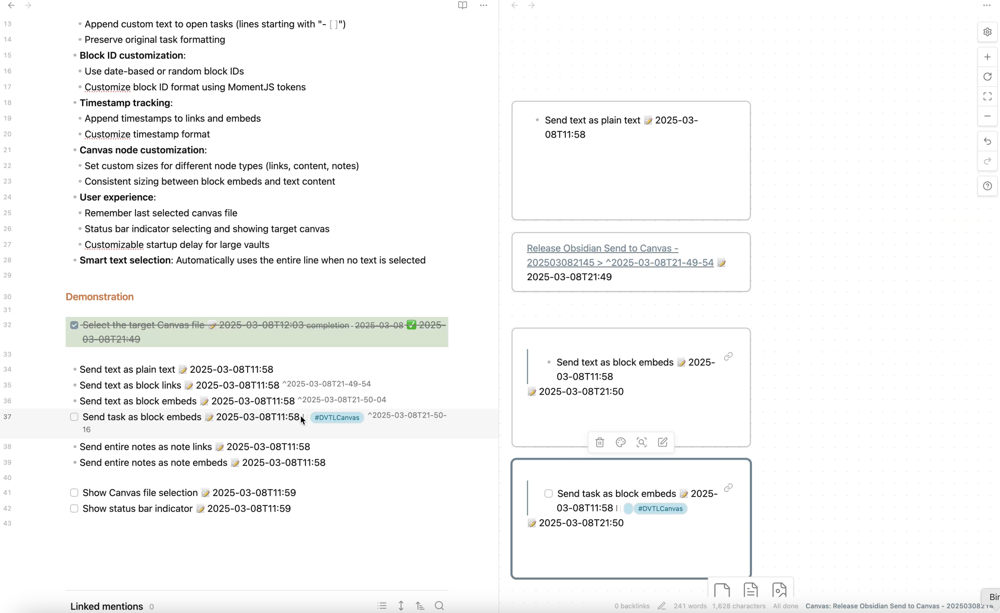

# Send to Canvas

 

An [Obsidian](https://obsidian.md/) plugin that allows you to send tasks, blocks, and notes to Canvas files as plain text, links, and embeds.

## Features

- **Multiple content formats**:
	- Send text as plain text
	- Send text as block links
	- Send text as block embeds
	- Send entire notes as note links
	- Send entire notes as note embeds
- **Open task customization**:
	- Append custom text to open tasks (lines starting with "- [ ]")
	- Preserve original task formatting
- **Block ID customization**:
	- Use date-based or random block IDs
	- Customize block ID format using MomentJS tokens
- **Timestamp tracking**:
	- Append timestamps to links and embeds
	- Customize timestamp format
- **Canvas node customization**:
	- Set custom sizes for different node types (links, content, notes)
	- Consistent sizing between block embeds and text content
- **User experience**:
	- Remember last selected canvas file
	- Status bar indicator selecting and showing target canvas
	- Customizable startup delay for large vaults
- **Smart text selection**: Automatically uses the entire line when no text is selected

## Videos and Articles

### Videos

## Commands

- **Send block text**: Send the selected text (or current line) to canvas as plain text
- **Send block link**: Send the selected text (or current line) to canvas as a block link
- **Send block embed**: Send the selected text (or current line) to canvas as a block embed
- **Send note link**: Send the current note to canvas as a note link
- **Send note embed**: Send the current note to canvas as a note embed

## Documentation

📚 **[View Full Documentation](https://ptkm.net/obsidian-send-to-canvas)**

Visit the documentation site to learn how to make the most of Send to Canvas in your Obsidian workflow.

## Support & Community

This plugin is developed and maintained during my free time. A lot of thought, energy, and care goes into making it reliable and user-friendly.

If you find Send to Canvas valuable in your daily workflow:

- If it helps you send content to your Canvas files more effectively
- If it saves you time and mental energy navigating your Canvas files

Please consider supporting my work. Your support would help me dedicate more time and energy to:

- Developing new features
- Maintaining code quality
- Providing support and documentation
- Making the plugin even better for everyone

### Ways to Support

You can support this project in several ways:

- ⭐ Star the project on GitHub
- 💝 
- 💌 Share your success stories and feedback
- 📢 Spread the word about the plugin
- 🐛 [Report issues](https://github.com/wenlzhang/obsidian-send-to-canvas/issues) to help improve the plugin

Thank you for being part of this journey! 🙏
